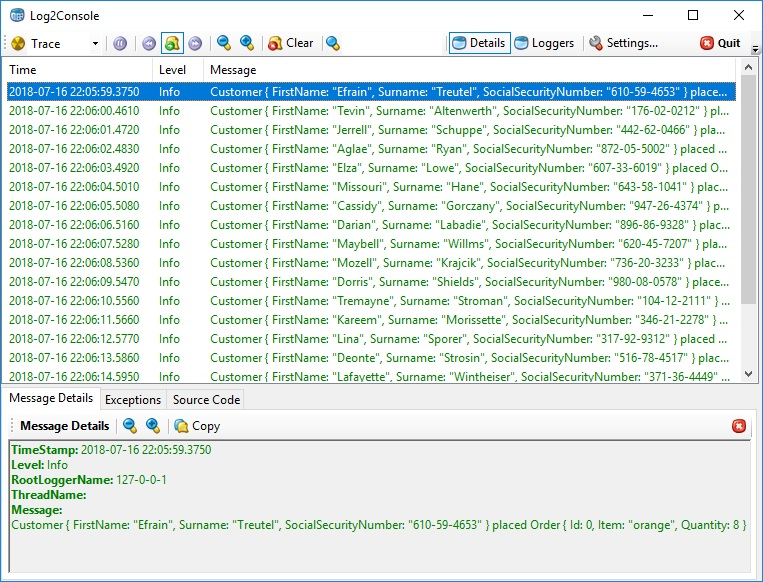
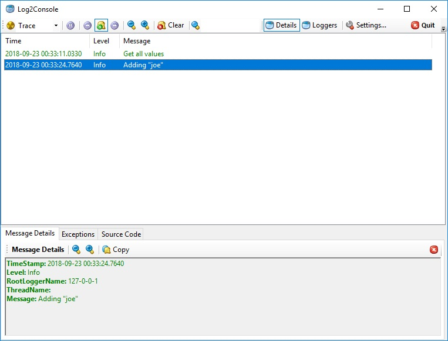

# Serilog.Sinks.Udp - Sample in .NET Framework

This repository contains two sample applications of [Serilog.Sinks.Udp](https://github.com/FantasticFiasco/serilog-sinks-upd) producing log events sent using UDP to Log2Console.

## Running the console application

1. Download the [latest release of Log2Console](https://github.com/Statyk7/log2console/releases)
1. Unzip the release
1. Install Log2Console using the installer found in the `output` folder
1. Start Log2Console and add a UDP receiver with the following settings:
    - Multicast Group Address (Optional): 
    - Receive Buffer Size: 10000
    - UDP Port Number: 7071
    - Use IPv6 Addresses: False
1. Open `dotnet-framework-sample.sln` is Visual Studio
1. Right-click on project _console-sample_ and select _Set As StartUp Project_
1. Press _F5_ to start debugging

What you will end up with is a console application producing log events displayed in Log2Console.

## Running the Web API application 

1. Download the [latest release of Log2Console](https://github.com/Statyk7/log2console/releases)
1. Unzip the release
1. Install Log2Console using the installer found in the `output` folder
1. Start Log2Console and add a UDP receiver with the following settings:
    - Multicast Group Address (Optional): 
    - Receive Buffer Size: 10000
    - UDP Port Number: 7071
    - Use IPv6 Addresses: False
1. Open `dotnet-framework-sample.sln` is Visual Studio
1. Right-click on project _web-api-sample_ and select _Set As StartUp Project_
1. Press _F5_ to start debugging
1. Using a web server, navigate to the endpoints exposed by `ValuesController`

What you will end up with is a web API application hosted in IIS Express producing log events displayed in Log2Console.

